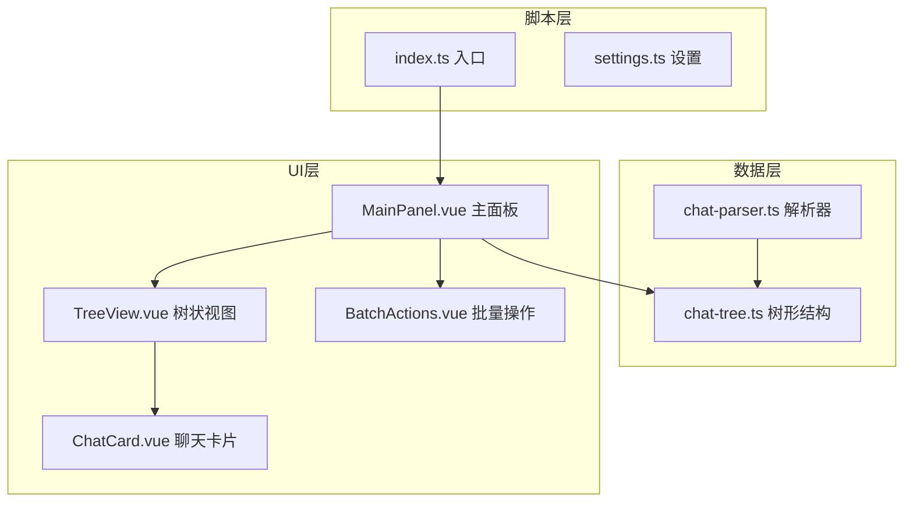

# 聊天记录管理器脚本开发计划

## 项目概述

开发一个酒馆助手脚本，用于优化角色卡的聊天记录管理体验。主要解决以下问题：

1. **可视化问题**：原生聊天记录从上到下排列，难以识别分支关系与内容
2. **批量管理缺失**：无法批量删除、归档无用的聊天分支

## 可用 API 分析

### 聊天历史相关

| API | 来源 | 功能 |
|-----|------|------|
| [`getChatHistoryBrief()`](/@types/function/raw_character.d.ts:124) | 酒馆助手 | 获取角色聊天历史摘要列表 |
| [`getChatHistoryDetail()`](/@types/function/raw_character.d.ts:134) | 酒馆助手 | 获取聊天详细内容 |
| [`RawCharacter.getChatsFromFiles()`](/@types/function/raw_character.d.ts:37) | 酒馆助手 | 从文件获取聊天内容字典 |
| [`SillyTavern.openCharacterChat()`](/@types/iframe/exported.sillytavern.d.ts:459) | 酒馆 | 打开指定聊天文件 |
| [`SillyTavern.renameChat()`](/@types/iframe/exported.sillytavern.d.ts:399) | 酒馆 | 重命名聊天 |
| `/delchat` | STScript | 删除当前聊天 |
| `/chat-manager` | STScript | 打开原生聊天管理器 |
| `/branch-create`、`/checkpoint-*` | STScript | 分支与检查点管理 |

### 聊天消息相关

| API | 功能 |
|-----|------|
| [`getChatMessages()`](/@types/function/chat_message.d.ts:58) | 获取指定范围消息 |
| [`SillyTavern.chat`](/@types/iframe/exported.sillytavern.d.ts:384) | 当前聊天消息数组 |

## 技术架构



## 详细任务分解

### 第一阶段：核心数据层

#### 1.1 聊天记录解析器 `chat-parser.ts`

**功能**：
- 获取当前角色的所有聊天文件列表
- 解析每个聊天文件的基本信息（创建时间、消息数量、最后消息预览）
- 检测聊天之间的分支关系（通过分析文件名或消息历史）

**数据结构**：
```typescript
interface ChatInfo {
  file_name: string;           // 聊天文件名
  display_name: string;        // 显示名称
  created_at: Date;            // 创建时间
  updated_at: Date;            // 最后更新时间
  message_count: number;       // 消息总数
  first_message_preview: string; // 第一条消息预览
  last_message_preview: string;  // 最后消息预览
  parent_chat?: string;        // 父聊天文件名（如果是分支）
  branch_point?: number;       // 分支起点楼层号
  is_checkpoint: boolean;      // 是否为检查点聊天
}
```

#### 1.2 树形结构构建器 `chat-tree.ts`

**功能**：
- 将扁平的聊天列表转换为树形结构
- 支持按时间、名称、消息数量排序
- 支持搜索过滤

**数据结构**：
```typescript
interface ChatTreeNode {
  chat: ChatInfo;
  children: ChatTreeNode[];
  depth: number;
  is_expanded: boolean;
  is_selected: boolean;
}
```

### 第二阶段：UI 组件

#### 2.1 主面板 `MainPanel.vue`

**功能**：
- 工具栏：搜索框、排序选项、刷新按钮
- 批量操作区：全选、批量删除、批量归档
- 内容区：树状视图容器
- 状态栏：显示选中数量、总聊天数

**布局**：
```
┌──────────────────────────────────────┐
│ 🔍 搜索...     [排序 ▼] [刷新]       │
├──────────────────────────────────────┤
│ ☑ 全选  [删除选中] [折叠分支]        │
├──────────────────────────────────────┤
│                                      │
│   📁 主线剧情 (15条)                 │
│   ├─ 📁 分支A (8条)                  │
│   │  └─ 📄 分支A-1 (3条)             │
│   └─ 📄 分支B (5条)                  │
│   📄 其他聊天 (20条)                 │
│                                      │
├──────────────────────────────────────┤
│ 已选中 3 个 | 共 12 个聊天           │
└──────────────────────────────────────┘
```

#### 2.2 树状视图 `TreeView.vue`

**功能**：
- 递归渲染树形结构
- 支持展开/折叠节点
- 支持拖拽重排序（可选）
- 点击节点显示详情/切换聊天

#### 2.3 聊天卡片 `ChatCard.vue`

**功能**：
- 显示聊天基本信息
- 悬浮显示预览内容
- 多选复选框
- 右键菜单：打开、重命名、删除、创建分支

**设计**：
```
┌─────────────────────────────────────┐
│ ☐ 📄 主线剧情-2024-12-28            │
│    15条消息 | 最后更新: 10分钟前     │
│    "早上好，今天有什么计划？"        │
└─────────────────────────────────────┘
```

#### 2.4 批量操作组件 `BatchActions.vue`

**功能**：
- 全选/取消全选
- 批量删除（带确认对话框）
- 批量归档到文件夹（可选）
- 导出选中聊天（可选）

### 第三阶段：脚本集成

#### 3.1 入口文件 `index.ts`

**功能**：
- 注册脚本按钮 "聊天管理器"
- 在酒馆页面挂载 Vue 应用
- 监听角色切换事件刷新数据

```typescript
import MainPanel from './MainPanel.vue';
import { teleportStyle, createScriptIdDiv } from '@/util/script';

$(() => {
  replaceScriptButtons([{ name: '聊天管理器', visible: true }]);

  eventOn(getButtonEvent('聊天管理器'), () => {
    openChatManager();
  });
});

function openChatManager() {
  // 创建弹窗或侧边栏显示管理界面
}
```

#### 3.2 设置管理 `settings.ts`

**可配置项**：
- 默认排序方式
- 预览文字长度
- 是否显示检查点
- 删除确认开关

### 第四阶段：增强功能

#### 4.1 分支关系检测

**方案**：
1. 分析聊天文件名中的时间戳和特殊标记（如 `_branch_`、`_checkpoint_`）
2. 比较聊天开头 N 条消息的内容哈希，相同则视为分支关系
3. 利用酒馆的检查点元数据

#### 4.2 智能摘要

**方案**：
- 提取每个聊天的关键词/主题
- 显示用户最后输入的问题作为预览
- 可选：调用 AI 生成简短摘要

## 项目文件结构

```
src/
└── 聊天管理器/
    ├── index.ts                 # 脚本入口
    ├── settings.ts              # 设置管理
    ├── data/
    │   ├── chat-parser.ts       # 聊天解析器
    │   ├── chat-tree.ts         # 树形结构
    │   └── types.ts             # 类型定义
    ├── components/
    │   ├── MainPanel.vue        # 主面板
    │   ├── TreeView.vue         # 树状视图
    │   ├── ChatCard.vue         # 聊天卡片
    │   ├── BatchActions.vue     # 批量操作
    │   └── SearchBar.vue        # 搜索栏
    └── styles/
        └── main.scss            # 全局样式
```

## 实施步骤

| 步骤 | 任务 | 依赖 |
|------|------|------|
| 1 | 创建项目骨架，配置 TypeScript 类型 | 无 |
| 2 | 实现 `chat-parser.ts` 获取聊天列表 | 1 |
| 3 | 实现 `chat-tree.ts` 构建树形结构 | 2 |
| 4 | 开发 `ChatCard.vue` 单个聊天卡片 | 1 |
| 5 | 开发 `TreeView.vue` 树状展示 | 3, 4 |
| 6 | 开发 `MainPanel.vue` 整合所有组件 | 5 |
| 7 | 实现批量选择与删除功能 | 6 |
| 8 | 添加搜索与排序功能 | 6 |
| 9 | 实现脚本按钮与弹窗入口 | 6 |
| 10 | 添加设置页面 | 9 |
| 11 | 分支关系智能检测优化 | 3 |
| 12 | 测试与 Bug 修复 | 全部 |

## 风险与注意事项

1. **API 限制**：酒馆助手 API 可能不支持直接删除非当前聊天，需要先切换再删除
2. **性能问题**：大量聊天文件时，需要分页加载或虚拟滚动
3. **并发安全**：批量删除时需要按顺序执行，避免竞态条件
4. **数据安全**：删除操作不可逆，必须有确认机制

## 下一步行动

请确认以上计划是否满足需求，如有调整意见请提出。确认后将切换到 Code 模式开始实现。
